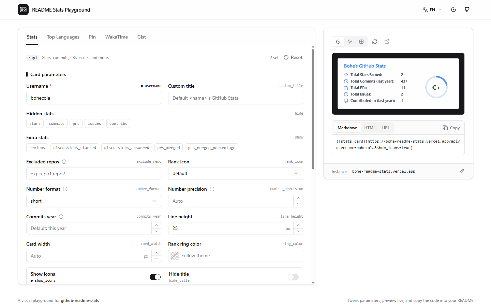

# README Stats Playground

[](https://github.com/bohecola/readme-stats-playground/actions/workflows/ci.yml)
[](./LICENSE)

[简体中文](./README.md) | English

A visual playground for [github-readme-stats](https://github.com/anuraghazra/github-readme-stats) cards: tweak parameters on the left, preview live on the right, and copy the URL / Markdown / HTML straight into your GitHub profile README.



> This is a community tool and is not affiliated with github-readme-stats. Cards are rendered by whichever github-readme-stats instance you point it at.

## Features

- **All 5 card types**: Stats, Top Languages, Pin, WakaTime and Gist
- **Complete parameter forms**, each field labelled with its URL key, with hints where useful; params that end up in the URL are marked
- **Live preview** on dark, light or transparent (checkerboard) backdrops
- **One-click copy** as URL, Markdown or HTML
- **Shared common style**: theme, colors and border settings apply to every card at once; any card can opt out and keep its own
- **Color picker**: HEX / RGB / HSL, alpha, presets and recent colors; visual gradient editor for `bg_color`
- **Switchable instance**: point it at any self-hosted github-readme-stats deployment, from the preview card's footer
- **Stored locally**: parameters and settings live in your browser's localStorage; nothing is uploaded
- **Light / dark theme**, following the system by default
- **English and Chinese UI**, following the browser language (English otherwise), switchable in the header

## Getting started

Requires Node.js 20+ and pnpm 11 (`corepack enable` installs the version pinned in `package.json`).

```bash
pnpm install
pnpm dev        # http://localhost:5173
pnpm build      # type-check + production build into dist/
pnpm preview    # serve the production build locally
```

## Configuration

Defaults are set with build-time env vars. Copy `.env.example` to `.env.local` (git-ignored), or set them in your hosting provider:

| Variable | Description | Default |
| --- | --- | --- |
| `VITE_DEFAULT_BASE_URL` | github-readme-stats instance to use by default | `https://github-readme-stats.vercel.app` |
| `VITE_DEFAULT_USERNAME` | GitHub username pre-filled on first visit | empty |

> The public instance is shared by everyone and frequently hits GitHub API rate limits. Consider [deploying your own](https://github.com/anuraghazra/github-readme-stats#deploy-on-your-own) and setting it as `VITE_DEFAULT_BASE_URL`.

## Deployment

It's a fully static site: run `pnpm build` and deploy `dist/` to any static host.

- **Vercel / Netlify**: import the repo, build command `pnpm build`, output directory `dist`, and add the env vars above if needed.

  [](https://vercel.com/new/clone?repository-url=https%3A%2F%2Fgithub.com%2Fbohecola%2Freadme-stats-playground)

- **GitHub Pages**: when served from a sub-path (`https://<user>.github.io/<repo>/`), build with a base path: `pnpm build --base=/<repo>/`.

## Troubleshooting

Errors shown in the preview come from the github-readme-stats instance you're using; the playground just displays them:

| Message | Cause | Fix |
| --- | --- | --- |
| `This username is not whitelisted` | The instance sets `WHITELIST` and only allows listed usernames | Use an allowed username, or remove `WHITELIST` from the instance |
| `Bad credentials` | The instance's `PAT_1` (GitHub Personal Access Token) is expired or invalid | Update the token on the instance |
| `Maximum retries exceeded` / rate limited | The instance ran out of GitHub API quota (common on the public one) | Retry later, or deploy your own instance |

## Project structure

```
src/
├── App.tsx                  # page layout and state
├── components/
│   ├── CardTabs.tsx         # card-type tabs
│   ├── CardForm.tsx         # parameter form per card
│   ├── ParamControl.tsx     # control per parameter type
│   ├── ColorPicker.tsx      # color picker incl. gradient editor
│   ├── Preview.tsx          # live preview + URL/Markdown/HTML output
│   ├── NumberInput.tsx      # numeric input with stepper buttons
│   ├── HintTip.tsx          # explanation bubble (info icon or dotted-underlined text)
│   ├── CopyButton.tsx       # copy button
│   ├── LanguageToggle.tsx   # language switch
│   ├── ThemeToggle.tsx      # light / dark toggle
│   └── ui/                  # shadcn/ui components (kept identical to the registry)
├── auto-imports.d.ts        # generated by unplugin-auto-import; React hooks need no import
├── i18n.ts                  # i18next setup and language detection
├── locales/                 # translations (en.json / zh.json)
└── lib/
    ├── config.ts            # env-driven defaults
    ├── endpoints.ts         # parameter structure per card (type, default, range)
    ├── paramText.ts         # parameter text lookup (card override → shared)
    ├── buildUrl.ts          # builds the card URL, omitting defaults and empty values
    ├── color.ts             # color conversions and gradient parsing
    └── themes.ts            # built-in theme names
```

## Tech stack

[Vite](https://vitejs.dev/) · [React 19](https://react.dev/) · TypeScript · [Tailwind CSS 4](https://tailwindcss.com/) · [shadcn/ui](https://ui.shadcn.com/) · [react-i18next](https://react.i18next.com/) · [react-colorful](https://github.com/omgovich/react-colorful) · [lucide](https://lucide.dev/)

## Contributing

Issues and pull requests are welcome. Please make sure `pnpm lint` and `pnpm build` pass before submitting (CI checks both).

- **React hooks need no import**: `useState`, `useEffect` etc. come from `unplugin-auto-import`, declared in `src/auto-imports.d.ts` (regenerated on dev/build; commit it along).
- **Don't hand-edit `src/components/ui/`**: those are stock shadcn/ui components. Customize at the call site or in a wrapper, so `npx shadcn@latest add --overwrite <component>` can always re-pull them.
- **Adding or changing a parameter**: define its structure in `src/lib/endpoints.ts`, and add its name and hint under `params` in `src/locales/*.json` (use `cardParams.<card>` to override text for one card).
- **Adding a language**: copy `src/locales/en.json`, translate it, and register it in `src/i18n.ts`. Keep the keys identical across locale files.

## License

[MIT](./LICENSE)
