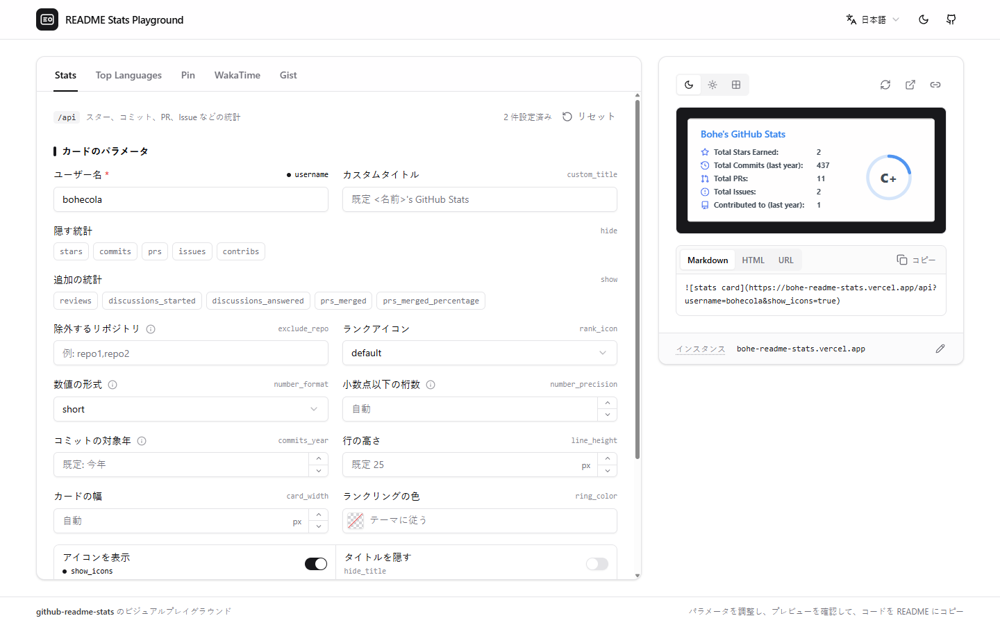

# README Stats Playground

[](https://github.com/bohecola/readme-stats-playground/actions/workflows/ci.yml)
[](./LICENSE)

[English](./README.md) | [简体中文](./README.zh-CN.md) | 日本語

[github-readme-stats](https://github.com/anuraghazra/github-readme-stats) カードのビジュアルプレイグラウンド。左でパラメータを調整し、右でライブプレビューを確認して、URL / Markdown / HTML をそのまま GitHub プロフィールの README にコピーできます。

**オンラインで使う：[readme-stats.deore.me](https://readme-stats.deore.me)**



> これはコミュニティ製のツールで、github-readme-stats 公式とは関係ありません。カードは指定した github-readme-stats インスタンスで描画されます。

## 機能

- github-readme-stats の全 5 種類のカードに対応：Stats、Top Languages、Pin、WakaTime、Gist
- すべてのパラメータをフォームで編集。名前・説明・元のパラメータ名を表示し、URL に含まれるものはマークされます
- ライブプレビューと、URL / Markdown / HTML のワンクリックコピー
- 共有可能なリンク：アドレスバーは常に現在のカードのパラメータを反映（`?card=stats&username=octocat&theme=dark`）。URL ひとつで設定を渡せます
- 共通スタイルは全カードで共有。必要ならカードごとに個別設定も可能
- 自分の github-readme-stats インスタンスで描画。データはすべてブラウザ内に保存されます

## はじめに

Node.js 20 以上と pnpm 11 が必要です（`corepack enable` で `package.json` に固定されたバージョンが入ります）。

```bash
pnpm install
pnpm dev        # http://localhost:5173
pnpm build      # 型チェック + 本番ビルド（dist/ に出力）
pnpm preview    # 本番ビルドをローカルで確認
```

## 設定

既定値はビルド時の環境変数で指定します。`.env.example` を `.env.local`（git 管理外）にコピーするか、ホスティングサービス側で設定してください：

| 変数 | 説明 | 既定値 |
| --- | --- | --- |
| `VITE_DEFAULT_BASE_URL` | 訪問者が自分のインスタンスを入力するまで使う github-readme-stats インスタンス | 空 — 訪問者が自分のインスタンスを入力 |
| `VITE_DEFAULT_USERNAME` | 初回アクセス時にあらかじめ入力される GitHub ユーザー名 | 空 |
| `VITE_SITE_URL` | デプロイ先の公開 URL。設定するとビルド時に canonical リンク、Open Graph 画像、JSON-LD が出力され、検索エンジンや AI クローラーに認識されやすくなります | 空 |

> カードの描画には github-readme-stats インスタンスが必要です。公開インスタンス（`github-readme-stats.vercel.app`）は不安定で現在停止中のため、既定では各訪問者が自分のインスタンスを入力します。持っていない場合は[自前でデプロイ](https://github.com/anuraghazra/github-readme-stats#deploy-on-your-own)してください。自分用にこのプレイグラウンドをホストする場合は、`VITE_DEFAULT_BASE_URL` に自分のインスタンスを設定しておくと最初から入力済みになります。

## デプロイ

完全な静的サイトです。`pnpm build` 後の `dist/` を任意の静的ホスティングに配置してください。

### 自分でデプロイする

セルフホストしなくても使えますが、次のような場合は自分でデプロイする価値があります：

- **自分の github-readme-stats インスタンスを最初から設定しておきたい**（`VITE_DEFAULT_BASE_URL`）。訪問者が入力する必要がなくなります
- 自分のドメインで使いたい
- 他人のデプロイに依存したくない

Vercel でワンクリック。途中で `VITE_DEFAULT_BASE_URL` の入力を求められるので、自分のインスタンスを入力するか空のままにしてください：

[](https://vercel.com/new/clone?repository-url=https%3A%2F%2Fgithub.com%2Fbohecola%2Freadme-stats-playground&project-name=readme-stats-playground&repository-name=readme-stats-playground&env=VITE_DEFAULT_BASE_URL&envDescription=Your%20github-readme-stats%20instance%20(pre-filled%20for%20visitors)%3B%20leave%20empty%20to%20let%20each%20visitor%20enter%20their%20own&envLink=https%3A%2F%2Fgithub.com%2Fbohecola%2Freadme-stats-playground%23configuration)

Vercel / Netlify / Cloudflare Pages に手動でインポートする場合：ビルドコマンド `pnpm build`、出力ディレクトリ `dist` を指定し、[設定](#設定) の環境変数を追加します。初回デプロイ後に `VITE_SITE_URL` をサイトの URL に設定して再デプロイすると、検索エンジン向けのメタデータが出力されます。

**GitHub Pages**：サブパス（`https://<user>.github.io/<repo>/`）で配信する場合は、ベースパスを指定してビルドします：`pnpm build --base=/<repo>/`

## トラブルシューティング

プレビューに表示されるエラーは、使用している github-readme-stats インスタンスからのものです。プレイグラウンドはそれをそのまま表示しているだけです：

| メッセージ | 原因 | 対処 |
| --- | --- | --- |
| `This username is not whitelisted` | インスタンスに `WHITELIST` が設定されており、リストにあるユーザー名しか許可されていない | 許可されたユーザー名を使うか、インスタンスから `WHITELIST` を外す |
| `Bad credentials` | インスタンスの `PAT_1`（GitHub Personal Access Token）が期限切れまたは無効 | インスタンス側でトークンを更新する |
| `Maximum retries exceeded` / レート制限 | インスタンスの GitHub API 割り当てを使い切った | 時間をおいて再試行するか、インスタンスにトークンを追加する（`PAT_2`、`PAT_3`…） |

## プロジェクト構成

```
src/
├── App.tsx                  # ページレイアウトと状態管理
├── components/
│   ├── CardTabs.tsx         # カード種別のタブ
│   ├── CardForm.tsx         # カードごとのパラメータフォーム
│   ├── ParamControl.tsx     # パラメータ型ごとのコントロール
│   ├── ColorPicker.tsx      # カラーピッカー（グラデーション編集を含む）
│   ├── Preview.tsx          # ライブプレビュー + URL/Markdown/HTML 出力
│   ├── NumberInput.tsx      # ステッパー付き数値入力
│   ├── HintTip.tsx          # 説明バブル（情報アイコン、または点線下線付きテキスト）
│   ├── CopyButton.tsx       # コピーボタン
│   ├── LanguageToggle.tsx   # 言語切り替え
│   ├── ThemeToggle.tsx      # ライト / ダーク切り替え
│   └── ui/                  # shadcn/ui コンポーネント（registry と同一のまま保持）
├── auto-imports.d.ts        # unplugin-auto-import が生成。React hooks の import は不要
├── i18n.ts                  # i18next の初期化と言語検出
├── locales/                 # 翻訳ファイル（en.json / zh.json / ja.json）
└── lib/
    ├── config.ts            # 環境変数からの既定値
    ├── endpoints.ts         # カードごとのパラメータ定義（型・既定値・範囲）
    ├── paramText.ts         # パラメータ文言の解決（カード個別 → 共通）
    ├── buildUrl.ts          # カード URL の組み立て（既定値と空値は省略）
    ├── urlState.ts          # ページ URL ⇄ カードの状態（共有リンク）
    ├── color.ts             # 色の変換とグラデーションの解析
    └── themes.ts            # 組み込みテーマ一覧
```

## 技術スタック

[Vite](https://vitejs.dev/) · [React 19](https://react.dev/) · TypeScript · [Tailwind CSS 4](https://tailwindcss.com/) · [shadcn/ui](https://ui.shadcn.com/) · [react-i18next](https://react.i18next.com/) · [react-colorful](https://github.com/omgovich/react-colorful) · [lucide](https://lucide.dev/)

## コントリビュート

Issue や Pull Request を歓迎します。送る前に `pnpm lint` と `pnpm build` が通ることを確認してください（CI でも両方チェックされます）。

プロジェクトの約束事——React hooks の自動 import、`src/components/ui/` を shadcn/ui のまま保つこと、パラメータと文言の置き場所——は [AGENTS.md](./AGENTS.md) にまとめてあります。人にもコーディングエージェントにも同じく適用されます。

- **パラメータの追加・変更**：`src/lib/endpoints.ts` に定義を追加し、`src/locales/*.json` の `params` に名前と説明を追加します（特定カードだけ文言を変えたい場合は `cardParams.<card>` で上書き）。
- **言語の追加**：`src/locales/en.json` をコピーして翻訳し、`src/i18n.ts` に登録します。各言語ファイルのキーは揃えてください。

## ライセンス

[MIT](./LICENSE)
