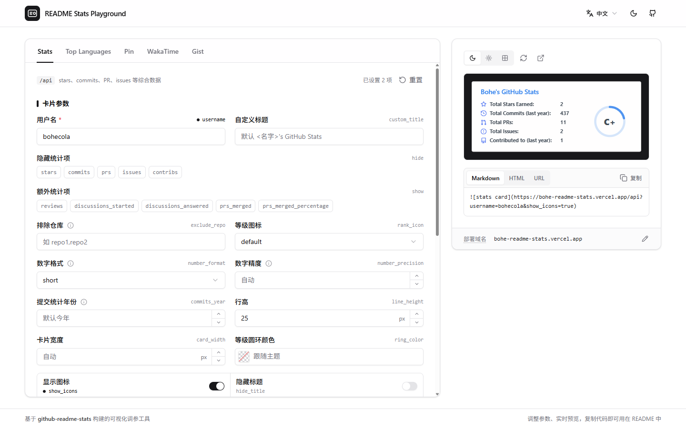

# README Stats Playground

[](https://github.com/bohecola/readme-stats-playground/actions/workflows/ci.yml)
[](./LICENSE)

[English](./README.md) | 简体中文 | [日本語](./README.ja.md)

[github-readme-stats](https://github.com/anuraghazra/github-readme-stats) 与 [GitHub Stats Extended](https://github.com/stats-organization/github-stats-extended) 卡片的可视化调参工具：左侧改参数，右侧实时预览，一键复制 URL / Markdown / HTML 到你的 GitHub 主页 README。

**在线使用：[readme-stats.deore.me](https://readme-stats.deore.me)**



> 本项目是社区工具，与上述项目官方均无关联。卡片由你指定的实例渲染：可以是原版 github-readme-stats，也可以是它仍在维护、API 兼容的后继项目 [GitHub Stats Extended](https://github.com/stats-organization/github-stats-extended)。

## 功能

- 覆盖 github-readme-stats 全部 5 种卡片：Stats、Top Languages、Pin、WakaTime、Gist
- 参数即表单：每个参数都有名称、说明和原始参数名，写入 URL 的参数会被标记，仅 GitHub Stats Extended 支持的参数带有 ext 标签
- 实时预览，一键复制 URL / Markdown / HTML
- 可分享链接：地址栏始终对应当前卡片的参数（`?card=stats&username=octocat&theme=dark`），一条 URL 就能把配置交给别人
- 通用样式对所有卡片共用，单张卡片也可以单独设置
- 支持 github-readme-stats 和 GitHub Stats Extended 实例，公共或自建均可；所有数据只保存在浏览器本地

## 快速开始

需要 Node.js 20.19+（或 22.12+）和 pnpm 11（推荐用 `corepack enable` 自动安装 `package.json` 中指定的版本）。

```bash
pnpm install
pnpm dev        # http://localhost:5173
pnpm build      # 类型检查 + 生产构建，产物在 dist/
pnpm preview    # 本地预览生产构建
```

## 配置

通过构建时环境变量设置默认值。复制 `.env.example` 为 `.env.local`（不会被提交），或在托管平台中设置：

| 变量 | 说明 | 默认值 |
| --- | --- | --- |
| `VITE_DEFAULT_BASE_URL` | 访客选择自己的实例之前默认使用的卡片实例（github-readme-stats 或 GitHub Stats Extended） | 空——由访客选择实例 |
| `VITE_DEFAULT_USERNAME` | 首次打开时预填的 GitHub 用户名 | 空 |
| `VITE_SITE_URL` | 站点的公开地址；设置后构建会生成 canonical 链接、Open Graph 图片和 JSON-LD，便于搜索引擎和 AI 爬虫识别 | 空 |

> 渲染卡片需要一个 github-readme-stats 兼容实例。github-readme-stats 本身已停止维护，公共实例也被暂停；后继项目 [GitHub Stats Extended](https://github.com/stats-organization/github-stats-extended) 与之 API 兼容，并维护着公共实例 `github-stats-extended.vercel.app`，Playground 里一键即可使用。两个项目的自建实例同样支持——给自己部署 Playground 时，把 `VITE_DEFAULT_BASE_URL` 设成你的实例，打开就是填好的。

## 部署

这是一个纯静态站点，`pnpm build` 后把 `dist/` 部署到任意静态托管即可。

### 部署自己的实例

不自建也能直接用，但以下情况值得自己部署一份：

- 希望**预填好你自己的卡片实例**（`VITE_DEFAULT_BASE_URL`），访客不用再选；
- 想用自己的域名；
- 不想依赖别人的站点。

Vercel 一键部署——过程中会要求填写 `VITE_DEFAULT_BASE_URL`，填你的实例，或者留空：

[](https://vercel.com/new/clone?repository-url=https%3A%2F%2Fgithub.com%2Fbohecola%2Freadme-stats-playground&project-name=readme-stats-playground&repository-name=readme-stats-playground&env=VITE_DEFAULT_BASE_URL&envDescription=Your%20github-readme-stats%20instance%20(pre-filled%20for%20visitors)%3B%20leave%20empty%20to%20let%20each%20visitor%20enter%20their%20own&envLink=https%3A%2F%2Fgithub.com%2Fbohecola%2Freadme-stats-playground%23configuration)

也可以在 Vercel / Netlify / Cloudflare Pages 手动导入仓库：构建命令 `pnpm build`，输出目录 `dist`，再按 [配置](#配置) 一节添加环境变量。首次部署后，把 `VITE_SITE_URL` 设为站点地址并重新部署，搜索引擎用的元数据才会生成。

**GitHub Pages**：站点部署在子路径（`https://<user>.github.io/<repo>/`）时，需要构建时指定 base：`pnpm build --base=/<repo>/`。

## 常见问题

预览里显示的错误信息来自你所用的卡片实例，Playground 只是如实展示：

| 提示 | 原因 | 处理 |
| --- | --- | --- |
| `This username is not whitelisted` | 实例设置了 `WHITELIST` 环境变量，只允许名单内的用户名 | 换成允许的用户名，或在实例中移除 `WHITELIST` |
| `Bad credentials` | 实例的 `PAT_1`（GitHub Personal Access Token）过期或无效 | 在实例中更新 token |
| `Maximum retries exceeded` / 限流 | 实例的 GitHub API 额度用完 | 稍后再试，或给实例多配几个 token（`PAT_2`、`PAT_3`…） |

## 项目结构

```
src/
├── App.tsx                  # 页面布局、状态管理
├── components/
│   ├── CardTabs.tsx         # 卡片类型切换
│   ├── CardForm.tsx         # 按卡片渲染参数表单
│   ├── ParamControl.tsx     # 按参数类型渲染控件
│   ├── ColorPicker.tsx      # 取色器（含渐变编辑）
│   ├── Preview.tsx          # 实时预览 + URL/Markdown/HTML 输出
│   ├── NumberInput.tsx      # 带步进按钮的数值输入
│   ├── HintTip.tsx          # 说明气泡（ⓘ 图标或带虚线下划线的文字）
│   ├── CopyButton.tsx       # 复制按钮
│   ├── LanguageToggle.tsx   # 语言切换
│   ├── ThemeToggle.tsx      # 明暗主题切换
│   └── ui/                  # shadcn/ui 组件（与 registry 保持一致，不手改）
├── auto-imports.d.ts        # unplugin-auto-import 生成，React hooks 无需 import
├── i18n.ts                  # i18next 初始化与语言检测
├── locales/                 # 翻译文件（en.json / zh.json / ja.json）
└── lib/
    ├── config.ts            # 环境变量读取的默认配置
    ├── endpoints.ts         # 各卡片的参数结构（类型、默认值、取值范围）
    ├── paramText.ts         # 参数文案查找（卡片覆盖 → 通用）
    ├── buildUrl.ts          # 拼接卡片 URL（省略默认值与空值）
    ├── urlState.ts          # 页面 URL ⇄ 卡片状态（可分享链接）
    ├── color.ts             # 颜色格式换算与渐变解析
    └── themes.ts            # 内置主题列表
```

## 技术栈

[Vite](https://vitejs.dev/) · [React 19](https://react.dev/) · TypeScript · [Tailwind CSS 4](https://tailwindcss.com/) · [shadcn/ui](https://ui.shadcn.com/) · [react-i18next](https://react.i18next.com/) · [react-colorful](https://github.com/omgovich/react-colorful) · [lucide](https://lucide.dev/)

## 参与贡献

欢迎提交 Issue 和 Pull Request。提交前请确保 `pnpm lint` 和 `pnpm build` 通过（CI 会自动检查）。

项目约定——React hooks 自动导入、`src/components/ui/` 保持 shadcn/ui 原样、参数和文案放在哪里——都写在 [AGENTS.md](./AGENTS.md) 里，对人和编码 agent 同样适用。

- **新增或调整参数**：在 `src/lib/endpoints.ts` 中定义结构，并在 `src/locales/*.json` 的 `params` 下补充名称和说明（某张卡片含义不同时写在 `cardParams.<卡片>` 下覆盖）。
- **新增语言**：复制 `src/locales/en.json` 翻译后，在 `src/i18n.ts` 中注册即可。各语言文件的 key 需保持一致。

## 许可证

[MIT](./LICENSE)
